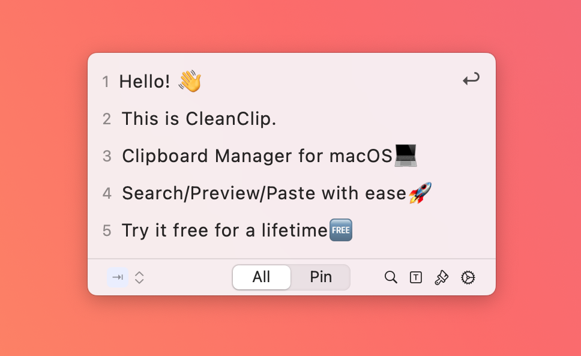
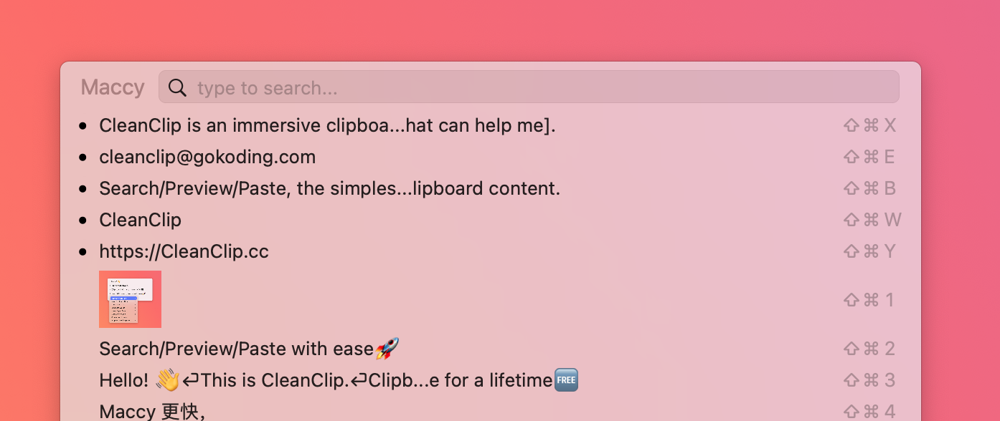
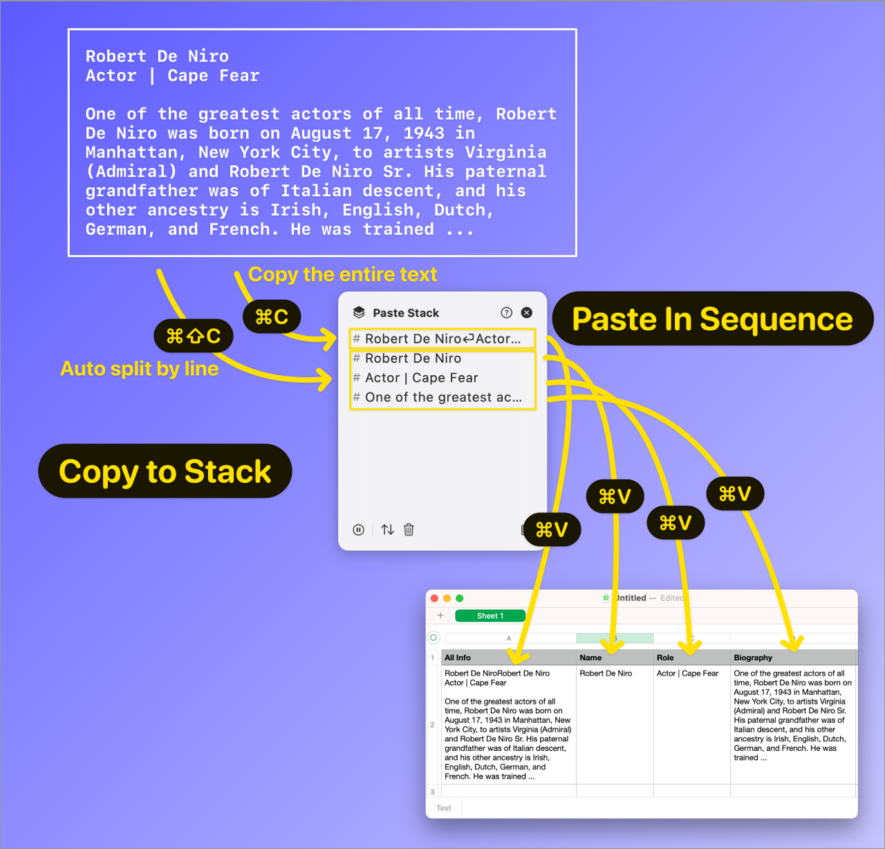

# CleanClip - A Clipboard Manager Based on Maccy, Still Maintaining Lightweight, Clean, Easy-to-use

Hello everyone,

Many people may have heard of Maccy - a lightweight, open source clipboard manager on Mac.

We have new ideas based on the existing features and interface of Maccy, which we believe will align more closely with our own usage habits. Fortunately, Maccy's open-source code uses the MIT license, which allows us to develop a new clipboard manager on top of Maccy without having to spend time dealing with many tricky and time-consuming tasks. Thank you, Maccy.

We named this clipboard software [CleanClip](https://cleanclip.cc?ref=fndxmaccy) (inspired by my favorite screenshot software, CleanShot X). CleanClip inherits the excellent features of Maccy: **Lightweight, clean, easy to use, keyboard-first**. We used the saved time to add new features and optimize the details to make it more user-friendly.

> Clipboard managers can help us automatically keep a record of our copy activities to avoid the risk of content being overwritten. It can also help us quickly find previously copied records, thereby enhancing productivity.
> 

## **Differences between CleanClip and Maccy**

### UI Style

Both are minimalist styles, with CleanClip leaning towards a white minimalist design, and Maccy leaning towards a system menu style. Maccy's style has more customizable options, while CleanClip tends to be non-customizable.

Maccy

In the initial window, CleanClip only displays the first 5 records. Press the tab key to expand the number of items from 5 to 10, continue to press tab to flip to the 11-20 items. Start searching by directly entering letters.

Maccy will display as many items as possible on the screen.

The reason for this design in CleanClip is: **80% of the time we can find the answers in the most recent 5 items**, 15% of the remaining time we can find the answers in the first 10 items, and the remaining 5% require us to continue to go back or use the search function to find.

Therefore, only 5 items are displayed in the initial state, which can allow us to see the simplest page most of the time, avoiding unnecessary visual elements' disturbance.

### Interaction, Keyboard Shortcut Details

Both are **KEYBOARD-FIRST** designs, **CleanClip** has **reduced even more keys** based on Maccy.

CleanClip

Maccy

|  | CleanClip | Maccy | Strength and Weakness |
| --- | --- | --- | --- |
| Paste Item | Number | ⌘+Number |  |
| Paste as Plain Text | Long press number, then short press number | ⌘+⇧+Number | CleanClip's keys are easier to remember and support more formats. Maccy is faster, no need for an extra menu, but you need to remember the combination keys. |
| Preview | Space | Mouse hover |  |
| Search | Enter letters directly to search | Enter letters directly to search |  |
| Paste Pinboards | ⌘;; Number | ⌘; ⌘+Letter | CleanClip's page is cleaner, Maccy does not need to switch pages. |
| Paste Stack | ⌘’ | Not Supported |  |

n summary, we can observe that except for invoking the window, **CleanClip does not employ any unnecessary modifiers**. This approach significantly **minimizes cognitive load and enhances operation efficiency**.

---

### Paste Stack Feature

Supported by CleanClip, not supported by Maccy.

Paste Stack allows users to collect some content through copying into a queue, and then each time CMD+V is pressed, the next item is pasted in order.

- ⌘C Copies the entire text into the queue
- ⌘⇧C Automatically splits the original text by line, then puts each line into the queue separately
- Each time ⌘V is pressed, the next item is automatically pasted in order.

This feature is suitable for workflows that are determined, require a lot of copying and pasting of text, or collecting images, text, and other work.

Preview video: https://www.reddit.com/r/macapps/comments/17t9cwb/cleanclip_has_released_its_paste_stack_feature/

### Pop-up Position

Different pop-up positions may cause varying degrees of distraction and decrease in efficiency. We believe that the best way to minimize these disruptions is to pop-up at the text input cursor's location.

|  | CleanClip | Maccy |
| --- | --- | --- |
| Pop-up Position | Text Input Cursor | Mouse, Window Center, Menu Bar |
| Advantage | More immersive user experience, no need for context switch | Variety of choices |

Preview video: https://cleanclip.cc/videos/followcursornoshadow265.mp4

## **Differences between CleanClip and Other Competitors**

- CleanClip's interactions are more customized for quick keyboard operations, with a keyboard-first approach. Other competitors merely customize their shortcut keys, remaining mouse-first. The advantage of the keyboard is its higher efficiency, while the mouse is more user-friendly for the general public.
- A more simplified interface and keyboard shortcut design. We are taking advantage of a well-thought-out keyboard shortcut design to perform more functions with fewer keys and key presses. While significantly reducing the memory load, CleanClip has some functions that other clipboard tools cannot perform only with the keyboard.
- The overall design of CleanClip is very suitable for those who prioritize keyboard efficiency.
- It uses a more immersive popup position design: at the text input cursor.
- The Paste Stack feature deeply optimizes workflows. It allows users to collect some content into a queue by copying, and then each time CMD+V is pressed, the next item is pasted in order. This feature is very friendly to jobs that deal with tables and forms.
- Better memory optimization.
- When copying quickly, CleanClip will not miss items.

| Product | Price | Popup Position | Simplified UI | Speed (Will it miss when copying quickly) | Memory Optimization | Darkmode Adaptation | Paste Stack | Pinboards | Smart Lists | Output Formatting | Mobile |
| --- | --- | --- | --- | --- | --- | --- | --- | --- | --- | --- | --- |
| CleanClip | $12/one-year update $20/lifetime update (Christmas price $13.99/lifetime update) | Text input cursor | 🌟🌟🌟🌟🌟 | 🌟🌟🌟🌟🌟 | 🌟🌟🌟🌟 | ✅ | ✅ | ✅ | ❌ (Coming) | ✅ | ❌ (Coming) |
| Paste | $29.99/year | Bottom of the screen | 🌟🌟🌟 | 🌟🌟 | 🌟🌟🌟🌟🌟 | Incomplete | ✅ | ✅ | ❌ | ❌ | ✅ |
| Copy'em | $14.99/lifetime | Last position | 🌟🌟🌟 | 🌟🌟🌟🌟 | 🌟🌟🌟🌟 | ✅ | ❌ | ✅ | ❌ | ✅ | ✅ |
| PastePal | $14.99/lifetime | Edge of the screen | 🌟🌟🌟 | 🌟🌟🌟 | 🌟🌟🌟 | ✅ | ❌ | ✅ | ✅ | ✅Flexible Customization | ✅ |
| PasteNow | $8/lifetime | Menu bar, last position, mouse cursor | 🌟🌟🌟 | 🌟🌟🌟🌟🌟 | 🌟🌟 | Incomplete | ❌ | ✅ | ✅ | ❌ | ❌ |
| Maccy | Free | Mouse cursor, center of window, center of screen | 🌟🌟🌟🌟 | 🌟🌟 | 🌟🌟 | ✅ | ❌ | ✅ | ❌ | ❌ | ❌ |

## Other Content

**Our Donation Plan for Maccy**

Thanks to Maccy for their help, we will **donate 3% of our after-tax income to Maccy**, **which we will announce publicly every month, until 2024.12.25**. It may not be much, but it's just to show support for the open-source project.

**Plan for Maccy Open Source Contributors and Donators**

For those who have contributed to Maccy's open-source project and made donations to Maccy, we offer a **40% discount**. Please send relevant proof to the email [hello@cleanclip.cc](mailto:hello@cleanclip.cc).

**Christmas Discount🎁**

In addition, we have just launched a **Christmas discount**, everyone can enjoy a **30% discount** with code **XMAS23** on all lifetime plans till 12.30.

**All the Features and Preview Videos**

Visit：[https://cleanclip.cc](https://cleanclip.cc?ref=fndxmaccy2)